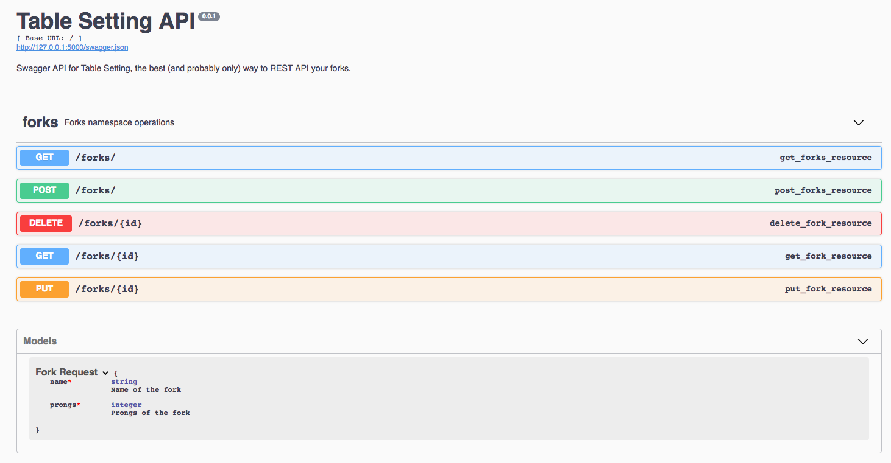

# Table Setting 

Table Setting is a single file python web application built primarily for demonstration purposes.  The intent is to do something more realistic than typical 'hello world' examples.  As such Table Setting is a REST API currently allowing CRUD operations on forks.  When running, the Table Setting application exposes a Swagger UI:



Table setting is packaged using [Habitat](https://www.habitat.sh).
 
 
## How to run locally 

The main prerequisite for Table Setting is having a 3.x version of [python installed](https://docs.python-guide.org/starting/installation/).  Next, create a virtualenv and use it to install the necessary dependencies and run the application:
```bash
$ git clone https://github.com/skpaterson/table-setting
$ cd table-setting
# If the next command fails it will probably be due to python2* being in your PATH.  As a quick alternative, could try "python3.7 -m venv tsenv" instead. 
$ python -m venv tsenv
$ . tsenv/bin/activate
$ pip install -r requirements.txt
$ python run_app.py 
```

## Testing Table Setting

Table Setting has a `requirements-dev.txt` file for development dependencies.   Assuming a virtualenv has already been activated, run the following from the root of the repository:

```bash
$ pip install -r requirements-dev.txt
$ pytest -v test_app.py
===================================================================== test session starts ======================================================================
platform darwin -- Python 3.7.0, pytest-3.7.0, py-1.5.4, pluggy-0.7.1 -- /Users/skpaterson/table-setting/venv/bin/python
cachedir: .pytest_cache
rootdir: /Users/skpaterson/table-setting, inifile:
collected 7 items

test_app.py::test_get_forks PASSED                                                                                                                       [ 14%]
test_app.py::test_create_read_delete_fork PASSED                                                                                                         [ 28%]
test_app.py::test_create_update_delete_fork PASSED                                                                                                       [ 42%]
test_app.py::test_create_multiple_forks PASSED                                                                                                           [ 57%]
test_app.py::test_non_existing_fork_fails PASSED                                                                                                         [ 71%]
test_app.py::test_creation_fails_invalid_schema PASSED                                                                                                   [ 85%]
test_app.py::test_update_fails_invalid_schema PASSED                                                                                                     [100%]

=================================================================== 7 passed in 0.45 seconds ===================================================================
```

## Building and running in the Habitat Studio

The below assumes an `ORIGIN` is configured for your habitat session, replace in the below accordingly.  For instructions on setting up Habitat, see [here](https://www.habitat.sh/docs/install-habitat/).

```bash
$ git clone https://github.com/skpaterson/table-setting
$ cd ~/table-setting
$ hab studio enter
[STUDIO] build
[STUDIO] sup-run
[STUDIO] hab svc load ORIGIN/table-setting 
[STUDIO] hab pkg install core/curl -b
[STUDIO] curl localhost:5000
```
